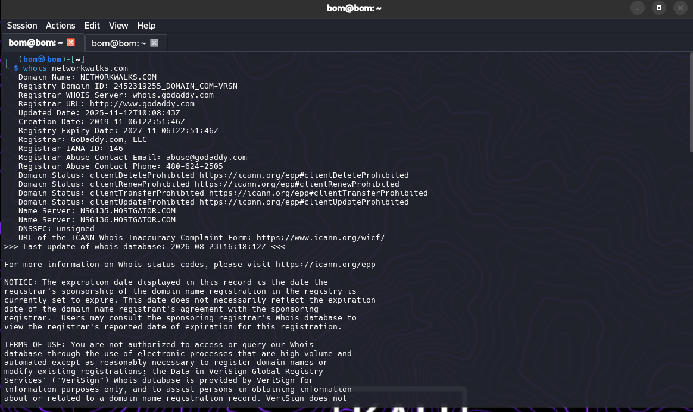
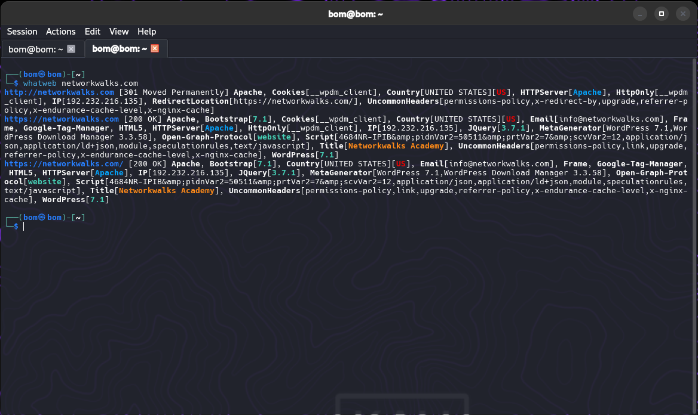

# 🛡️ Penetration Testing & OSINT Assessment Report

**Phase 1 & Phase 2 Execution — Reconnaissance & Network Discovery**

## 📋 Assessment Metadata

| Parameter | Details |
|---|---|
| Lead Auditor / Pentester | An Rothana |
| Program Identifier | B082-Networkwalks |
| Execution Date | 23 August 2026 |
| Modules Completed | W2-PM1: Kali Reconnaissance Tools · W2-PM2: Google Hacking Database (GHDB) · W2-PM3: Maltego Visual OSINT Analysis · W2-PM4: Passive Discovery via theHarvester · W2-PM5: Subnet Scanning with Zenmap & Nmap |
| Assessment Targets | 1. Primary Host: `networkwalks.com` (explicit written authorization verified) · 2. Internal Scope: Local Area Network (192.168.x.x/24) |
| Scope Authorization | Explicit Written Consent Granted |
| Lifecycle Coverage | Phase 1 (Reconnaissance) & Phase 2 (Scanning) Complete; Phases 3–5 In Progress |

## ⚠️ Liability Disclaimer

> These activities were performed only on systems and devices with secured written permission, or devices owned by the author. All materials are for education and research purposes only. Misuse can lead to criminal charges, heavy fines, loss of employment, and a permanent record. In most countries, unauthorised access is a crime even when nothing is damaged. The instructor, authors, and NetworkWalks are not responsible for misuse of this knowledge.

## 📌 Introduction

This report covers footprinting the `networkwalks.com` domain using six Kali Linux tools (W2-PM1), Google Dorking with GHDB (W2-PM2), visual OSINT mapping with Maltego (W2-PM3), passive harvesting with theHarvester (W2-PM4), and scanning the local network with Zenmap (W2-PM5).

Together these modules show how an attacker moves from gathering public information to mapping live hosts on a network. This is Week 2 of an ongoing cybersecurity internship at NetworkWalks Academy, under the mentorship of Waqas Karim (CCIE). All commands were run in Kali Linux 2026.1.

## 📌 Tools Used

| Tool | Purpose |
|---|---|
| WHOIS | Domain registration and ownership information gathering |
| WhatWeb | Web technology and server fingerprinting (CMS, plugins, IP) |
| Nslookup | DNS resolution and IP address discovery |
| Curl | HTTP header and server information gathering |
| Wafw00f | Web Application Firewall detection |
| DNSRecon | Enumerate all DNS records (NS, MX, SPF, TXT, SRV) |
| Google Hacking (GHDB) | Find exposed cameras and downloadable academic PDFs via search dorks |
| Maltego | Visual OSINT and relationship mapping |
| theHarvester | Passive reconnaissance and OSINT collection |
| Zenmap | Network discovery and port scanning |
| Kali Linux | Operating system used for reconnaissance and scanning |
| Kali Linux CMD (IP Route) | Local IP, interface, route, and gateway identification |

## 📌 Activities Performed

### a. Footprinting & Reconnaissance (W2-PM1)

Reconnaissance against `networkwalks.com` using WHOIS, WhatWeb, Nslookup, Curl, Wafw00f, and DNSRecon:

- **WHOIS** — Domain registration details: GoDaddy registrar, active dates (2019–2027), HostGator nameservers (`ns6135.hostgator.com`, `ns6136.hostgator.com`), WHOIS privacy protection.
- **WhatWeb** — Identified WordPress 7.0.4, WP Download Manager 3.3.58, Apache web server, jQuery 3.7.1, Bootstrap 7.0.4, IP `192.232.216.135`.
- **Nslookup** — Resolved `networkwalks.com` to host IP `192.232.216.135`.
- **Curl -I** — Retrieved HTTP/2 200 response headers: Apache server, caching headers (`x-nginx-cache: WordPress`), WordPress REST API endpoint `/wp-json/`.
- **Wafw00f** — Detected ModSecurity (SpiderLabs) WAF. Response signatures observed: 404, 405, 403, 502, 500 (fingerprinting artifacts, not confirmed vulnerabilities).
- **DNSRecon** — Enumerated NS, SOA, MX (`mail.networkwalks.com`), SPF records, cPanel autodiscover SRV records, BIND version `9.16.23-RH`.

### b. Search Engine Footprinting & GHDB (W2-PM2)

Used Google search operators (`intitle:`, `inurl:`, `site:`, `filetype:`, `index of:`) to locate publicly accessible resources.

<details>
<summary><strong>10x Live / Exposed Security Cameras</strong></summary>

| # | Link | Relevant Dork | Username / Password |
|---|---|---|---|
| 01 | cameraftp.com/Secure/Logon.aspx | `intitle:"Login" intext:"camera"` | (Authentication Required) |
| 02 | 71.41.223.210:81 | `intitle:"DEVICE" "Real-time IP Camera Monitoring System"` | admin / admin |
| 03 | 109.233.191.130:8080 | `intitle:"webcamXP" inurl:8080` | None (Direct Stream) |
| 04 | insecam.org/en/bytype/webcamxp | `inurl:mobile.html intitle:webcamXP` | None (Directory Portal) |
| 05 | myfishcam.homedns.org:444 | `intitle:"webcamxp" "Flash JPEG Stream"` | None (Direct Stream) |
| 06 | klsimer.edu/img/infrastructure/lb/ | `intitle:"Index of" "DCIM/camera"` | Open Directory |
| 07 | 109.233.191.130:8080/multi.html | `intitle:"webcamXP" inurl:8080` | None (Multi-View Feed) |
| 08 | shodan.io/search?query=webcamXP | `intitle:"webcamXP" inurl:8080` | (OSINT Search Engine) |
| 09 | 85.93.53.175:8080/gallery.html?page=6 | `intitle:"webcamXP 5" inurl:8080 'Live'` | None (Gallery Stream) |
| 10 | 95.255.183.164:8080/multi.html | `intitle:"WEBCAM 7 " -inurl:/admin.html` | None (Direct Feed) |

</details>

<details>
<summary><strong>10x Downloadable Mathematics Ebooks / Open Directories</strong></summary>

| # | Link | Relevant Dork | Notes |
|---|---|---|---|
| 01 | skylineuniversity.ac.ae/pdf/math/ | `intitle:index.of "parent directory" mathematics pdf` | Open Directory |
| 02 | wikiexplora.com/extensions/Facebook/ | `intitle:"index of" facebook-api` | Open Directory |
| 03 | ftp.u-picardie.fr/.../libwww-facebook-api-perl/ | `intitle:"index of" facebook-api` | Open Directory |
| 04 | nlnetlabs.nl/~koen/phonebook/ | `index of : "phonebook "` | Open Directory |
| 05 | upjohn.net/publications/phonebook/ | `index of : "phonebook "` | Open Directory |
| 06 | erewhon.superkuh.com/library/Math/ | `intitle:index.of "parent directory" mathematics pdf` | Open Directory |
| 07 | unm.edu/~megrad/Math/ | `intitle:index.of "parent directory" mathematics pdf` | Open Directory |
| 08 | education.giakonda.org.uk/Maths/ | `intitle:index.of "parent directory" mathematics pdf` | Open Directory |
| 09 | ochicken.net/library/Mathematics/ | `intitle:index.of "parent directory" mathematics pdf` | Open Directory |
| 10 | math.dartmouth.edu/~carlp/PDF/ | `intitle:index.of "parent directory" mathematics pdf` | Open Directory |

</details>

### c. Maltego Visual OSINT (W2-PM3)

Using Maltego Graph 4.12.1:
- Configured Maltego Data Hub transforms.
- Ran email transforms against `networkwalks.com` to confirm domain contacts (`info@networkwalks.com`).

### d. theHarvester Footprinting (W2-PM4)

Using theHarvester 4.10.1 — `theHarvester -d networkwalks.com -l 1000 -b all`:

- 3 ASNs identified (AS13335 / Cloudflare, AS31898, AS46606)
- 2 public IPs (masked — Cloudflare / hosting provider range)
- 1 public contact email: `info@networkwalks.com`
- 23 subdomain/host records (cpanel, webmail, autodiscover, mail, ftp, etc.)

### e. Network Scanning with Zenmap (W2-PM5)

Internal scanning performed on local LAN (`192.168.x.x/24`):

- `ip route` identified local IP `192.168.x.xxx/24`, subnet mask `/24`, default gateway `192.168.0.1` via `wlan0`.
- `nmap -T4 -F 192.168.0.xxx/24` in Zenmap discovered 3 active hosts:
  - `192.168.0.1` (Gateway/Router) — ports 53/tcp (DNS) and 80/tcp (HTTP) open (MAC sanitized)
  - `192.168.x.xxx` — 77/tcp filtered, service unidentified (MAC sanitized)
  - `192.168.x.xxx` (Kali workstation) — up, all 100 scanned TCP ports filtered

## 📌 Risk Analysis / Impact

| # | Risk / Finding | Evidence / Observation | Potential Impact | Risk Level |
|---|---|---|---|---|
| 1 | Web technology information disclosed | WhatWeb identified WordPress 7.0.4 and WP Download Manager 3.3.58 | Assists technology fingerprinting and vulnerability research | 🟡 Medium |
| 2 | DNS information exposed | DNSRecon identified DNS, MX, SPF records and BIND version 9.16.23-RH | Disclosing daemon versions assists targeted infrastructure profiling | 🟡 Medium |
| 3 | Multiple live hosts visible on local network | Zenmap identified 3 live hosts, ports 53/tcp and 80/tcp on 192.168.x.x/24 | Provides visibility of devices on the local network | 🟡 Medium |
| 4 | Server IP address identifiable | Nslookup resolved domain to 192.232.216.135 | Provides direct network location of the web service | 🟢 Low |
| 5 | HTTP technical information exposed | Curl returned response headers and exposed /wp-json/ | Assists technology fingerprinting and REST API route enumeration | 🟢 Low |
| 6 | WAF technology identifiable | Wafw00f identified ModSecurity (SpiderLabs) | Reveals perimeter security architecture | 🟢 Low |
| 7 | Email address harvested | WhatWeb + theHarvester — info@networkwalks.com | Can be used for phishing or social engineering | 🟢 Low |

**Risk Level Key:** 🔴 Critical · 🟡 Medium · 🟢 Low

> The risks above are observations from footprinting and scanning exercises, not confirmed vulnerabilities. No exploitation or vulnerability validation was performed.

## 📌 Recommendations

1. Review publicly exposed technology information regularly.
2. Keep WordPress core, plugins, and web servers routinely patched.
3. Suppress unnecessary server banners; add security headers (HSTS, CSP, X-Frame-Options).
4. Periodically audit DNS records and suppress BIND version banner leakage.
5. Keep ModSecurity enabled and tuned with updated rule sets.
6. Perform regular internal network discovery to identify unauthorized/rogue devices.
7. Restrict inbound access to SMB/NetBIOS ports 135, 139, and 445 on local workstations.
8. Disable UPnP on gateway devices.
9. Maintain up-to-date network topology documentation.
10. Always ensure scanning and OSINT testing are conducted within an authorized scope.

## 📌 Conclusion

The Week 2 internship activities provided practical experience in reconnaissance, OSINT, web technology fingerprinting, DNS enumeration, WAF detection, and network scanning. WHOIS, WhatWeb, Nslookup, Curl, Wafw00f, and DNSRecon combined to build an infrastructure profile of the target. Maltego provided a visual relationship map, and theHarvester collected ASNs, IPs, an email address, URLs, and host entries. The Zenmap exercise provided practical experience identifying live hosts and open/filtered ports on a local /24 network.

Reconnaissance and network scanning are foundational stages of a penetration testing methodology, helping security professionals understand a target environment before deeper security assessments.

## 📌 Evidence Collected

- **W2-PM1** — WHOIS query output, WhatWeb fingerprint, Nslookup resolution, Curl headers, Wafw00f WAF detection, DNSRecon enumeration
**WHOIS Query**
```bash
whois networkwalks.com
```


```bash
whatweb networkwalks.com
```

```bash
nslookup networkwalks.com
```

- **W2-PM3** — Maltego Data Hub/Transform Hub setup, domain-to-contact linkage graph
- **W2-PM4** — Subdomain enumeration via Baidu, multi-source engine passive scan (`-b all`)
- **W2-PM5** — Zenmap subnet quick scan results (hosts, hardware MACs sanitized)

## 👤 Author

**An Rothana**
Cybersecurity Intern — Batch: B082-NetworkWalks
NetworkWalks Academy Cybersecurity Track — Mentorship by Waqas Karim, CCIE
